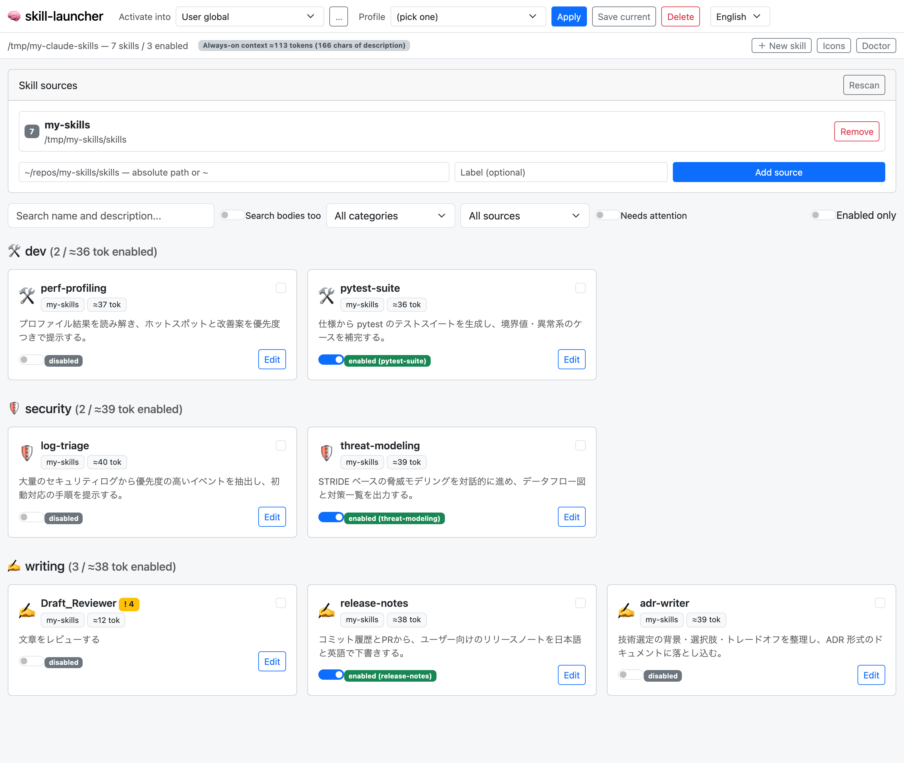

# skill-launcher

A local-only launcher / manager for Claude Skills (`SKILL.md`): collect them from several repos or folders, then browse, activate, edit and export them.

[日本語](README.md)

> **This is a local-only tool.** The server binds to `127.0.0.1` and has no authentication. It reads and writes local files (editing `SKILL.md`, creating symlinks under `.claude/skills`), so **do not expose it on a public network or a shared host**.

## Demo


Toggling a skill on, applying a saved profile, opening a skill with frontmatter warnings, and switching the UI to English.



*(Both show a demo instance with sample skills — not real data.)*

## What it does

1. **Skill sources** — register any folder (a repo where you keep skills, or `~/.claude/skills` itself) and it scans recursively for `SKILL.md`, reading `name` / `description` from the YAML frontmatter and deriving a category from frontmatter or the folder layout.
2. **Launcher UI** — skills grouped by category with emoji icons, plus search (name/description, optionally full-text over bodies), category/source filters, and "enabled only" / "needs attention" toggles.
3. **Activation toggle** — flipping a switch creates or removes a symlink named `<name>` in the activation target (falling back to a copy where symlinks are unavailable). **Only entries this tool created** are ever managed; skills you placed by hand are never touched.
4. **Multiple activation targets** — activate globally (`~/.claude/skills`) or into a specific project's `<project>/.claude/skills`.
5. **Profiles** — save a named set of enabled skills and switch the whole set with one click ("security research mode", "writing mode", …).
6. **Always-on context cost** — every enabled skill keeps its `name` + `description` in the system prompt, so the estimated token cost is shown for the whole set, per category, per card and for the current selection.
7. **Frontmatter lint** — warns about a missing or over-long `description`, a `name` that is not kebab-case or does not match its folder, an empty body, and so on, both as a card badge and in the editor.
8. **Edit, create, duplicate** — edit `SKILL.md` in the UI (always backed up first, and refused if the file changed since you opened it), browse bundled files (`references/`, `scripts/`), scaffold a new skill from a template, or duplicate an existing one.
9. **Doctor** — finds broken links, missing sources, stale copy-mode activations and unmanaged entries, with one-click relink / forget.
10. **Japanese / English UI** — switch from the navbar; the initial language follows the browser and is then remembered. Lint and doctor messages switch too.
11. **Export to a system prompt** — bundle the selected skills into a single Markdown file, for environments without a skills mechanism or for API use.

## Running it

```bash
git clone https://github.com/focuslight-nr/skill-launcher.git
cd skill-launcher
./start.sh
```

The first run creates its own `.venv` and installs `aiohttp` / `PyYAML`. The server starts on port `8877` (falling back to the next free port) and prints the URL; open `http://127.0.0.1:<port>/`.

Directly with Python:

```bash
.venv/bin/python server.py            # or: --port 9000
```

As an installed command:

```bash
pipx install .
skill-launcher
```

## Where state lives

```
~/.config/skill-launcher/
├── sources.json   # registered skill source roots
├── managed.json   # ownership manifest: entries this tool created, per target
├── profiles.json  # named activation sets
├── targets.json   # extra activation targets (a project's .claude/skills)
├── icons.json     # category -> emoji overrides
└── backups/       # a timestamped backup per edit
```

| Env var | Default | Purpose |
| --- | --- | --- |
| `SKILL_LAUNCHER_CONFIG_DIR` | `~/.config/skill-launcher` | config, manifest and backups |
| `SKILL_LAUNCHER_TARGET_DIR` | `~/.claude/skills` | default activation target |

## Ownership model

Existing skills live as `~/.claude/skills/<name>/SKILL.md` — one level deep. Claude's own discovery appears to assume that layout, so isolating this tool's entries in a subfolder would risk them never being loaded. Instead the tool keeps a **manifest**:

- Enabling creates `<name>` in the activation target and records it in `managed.json`.
- **Only entries listed in `managed.json` may be removed or overwritten** — including when applying a profile.
- If the name already exists but is not in the manifest (i.e. you placed it yourself), activation is **refused with a 409** and an alternative name is suggested. Nothing is ever overwritten.
- Where symlinks are not possible, a directory copy is used instead; the UI says so, and saving an edit re-syncs the copy.

## Safety

- Disabling requires `confirm: true` at the API level and a confirmation dialog in the UI.
- Edits are backed up first, and refused if the file changed after the editor was opened.
- Reads and writes are confined to `SKILL.md` files inside registered sources, and to files inside a skill's own folder.
- Beyond binding to `127.0.0.1`, the server validates the `Host` header (DNS-rebinding defence) and the `Origin` of state-changing requests (so another site in your browser cannot drive it).

## Development

```bash
.venv/bin/pip install -r requirements-dev.txt
.venv/bin/python -m pytest -q
.venv/bin/ruff check .
```

## Requirements

- macOS / Linux (symlink creation into the activation target; Windows untested)
- Python 3.9+ (tested on 3.9.6)

## License

[MIT](LICENSE)
