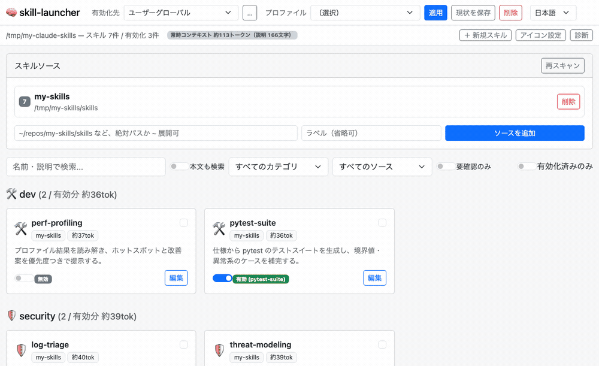
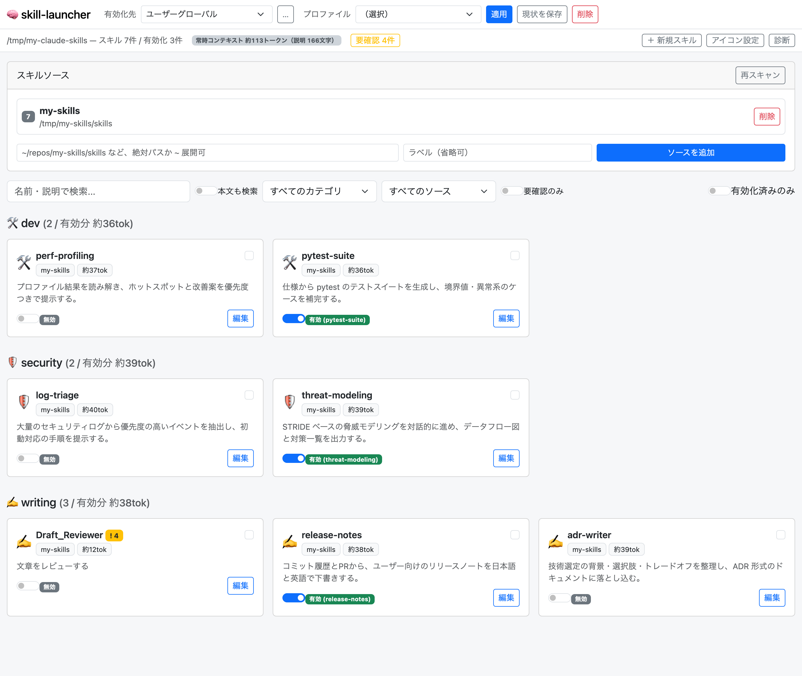

# skill-launcher

Claude Skills（`SKILL.md` 形式）を複数のリポ/フォルダから集めて、一覧・有効化・編集・エクスポートするための、ローカル専用のスキルランチャー / マネージャです。

[English](README.en.md)

> **ローカル専用ツールです。** サーバーは `127.0.0.1` のみにバインドし、認証機構はありません。ローカルファイルの読み書き（`SKILL.md` の編集、`.claude/skills` への symlink 作成）を行うため、**公開ネットワークや共有ホストに晒さないでください**。

## デモ



有効化トグル → プロファイルの一括適用 → frontmatter の警告つき編集画面 → 英語UIへの切り替え。



*（いずれもサンプルスキルを登録したデモ環境の画面です）*

## できること

1. **スキルソース管理** — 好きなフォルダ（例: スキルを格納しているローカルリポジトリ、`~/.claude/skills` 自体）を「ソース」として登録し、再帰的に `SKILL.md` をスキャン。YAMLフロントマターの `name` / `description` と、フロントマターまたはフォルダ階層から決まるカテゴリを一覧表示します。
2. **アイコン＋カテゴリ表示のランチャーUI** — カテゴリごとにグルーピングし、絵文字アイコン・名前・説明を表示。検索（名前・説明、任意で本文全文）、カテゴリ/ソースでの絞り込み、「有効化済みのみ」「要確認のみ」フィルタ。
3. **有効化トグル** — スイッチON/OFFで有効化先に `<name>` の symlink を作成／削除します（symlinkが張れない環境ではコピーに自動フォールバック）。**このツールが作った entry だけ**を管理対象とし、手で置いた既存スキルには一切触れません。
4. **有効化先の切り替え** — ユーザーグローバル（`~/.claude/skills`）と、プロジェクトごとの `<project>/.claude/skills` を切り替えて有効化できます。
5. **プロファイル** — 有効化のセットに名前を付けて保存し、ワンクリックで丸ごと切り替え。「セキュリティ調査モード」「執筆モード」のような使い分けができます。
6. **常時コンテキストコストの可視化** — 有効化中スキルの `name` + `description` は常にコンテキストに載るため、その概算トークン数を画面上部・カテゴリ見出し・カード・選択中スキルに表示します。
7. **フロントマターの検査（lint）** — `description` が無い/長すぎる、`name` がケバブケースでない、`name` とフォルダ名が一致しない、本文が空、などをカード上のバッジと編集画面で警告します。
8. **スキル編集・作成・複製** — `SKILL.md` をUIで編集（保存前に必ずタイムスタンプ付きバックアップ／他所での更新を検知して上書きを拒否）。同梱ファイル（`references/` や `scripts/`）の閲覧、テンプレートからの新規作成、既存スキルの複製にも対応。
9. **診断（doctor）** — リンク切れ、ソース消失、コピー方式のスキルの未反映、管理外エントリの検出と、ワンクリックの再リンク／管理解除。
10. **日本語 / 英語UI** — ナビバーのセレクタで切り替え（初回はブラウザの言語設定で自動判定、以後はブラウザに記憶）。lintや診断のメッセージも切り替わります。
11. **システムプロンプトへのエクスポート** — 選択したスキルを1つのMarkdownにまとめてダウンロード（Skills機構がない環境やAPI利用時の埋め込み用）。

## 起動方法

```bash
git clone https://github.com/focuslight-nr/skill-launcher.git
cd skill-launcher
./start.sh
```

初回は独自の `.venv` を作成して `aiohttp` / `PyYAML` をインストールします（リポジトリ内で完結、他プロジェクトの `.venv` とは独立）。起動するとポート `8877`（使用中なら空いているポートに自動フォールバック）でサーバーが立ち上がり、ログにURLが表示されます。ブラウザで `http://127.0.0.1:<port>/` を開いてください。

直接Pythonで起動したい場合:

```bash
.venv/bin/python server.py            # ポート指定: --port 9000
```

インストールして使う場合（`skill-launcher` コマンドが入ります）:

```bash
pipx install .
skill-launcher
```

`127.0.0.1` 限定バインドです（外部からはアクセスできません）。

## 使い方の流れ

1. 画面上部の「スキルソース」でフォルダを登録します。例:
   - `~/repos/my-skills/skills`（スキルを溜めているローカルリポジトリ）
   - `~/.claude/skills`（既存の手動配置スキルも一覧に出したい場合）
2. ナビバーの「有効化先」で、グローバルとプロジェクトを切り替えます（プロジェクトは「…」ボタンから登録。プロジェクトのルートを入れれば `.claude/skills` を補完します）。
3. 一覧からスキルを探し（検索・カテゴリ絞り込み可）、トグルスイッチでON/OFF。
4. よく使う組み合わせができたら「現状を保存」でプロファイル化。以後は選んで「適用」で一括切り替え。
5. 「編集」ボタンで `name` / `description` / 本文を書き換え、保存（自動バックアップあり）。
6. 使いたいスキルにチェックを入れ、画面下部の「エクスポート」で1枚のMarkdownとしてダウンロード。

## 設定・データの保存場所

すべて OS標準の設定ディレクトリ配下に集約しています。リポジトリやスキルの実体には一切書き込みません（編集操作を除く）。

```
~/.config/skill-launcher/
├── sources.json   # 登録したスキルソースの一覧
├── managed.json   # このツールが作った entry の台帳（所有権マニフェスト、有効化先ごと）
├── profiles.json  # 名前付きの有効化セット
├── targets.json   # 追加した有効化先（プロジェクトの .claude/skills など）
├── icons.json     # カテゴリ → 絵文字の上書き
└── backups/       # 編集のたびに作られる SKILL.md のバックアップ
```

環境変数で置き場所を変えられます（お試し実行や別環境での検証に便利）:

| 変数 | 既定値 | 用途 |
| --- | --- | --- |
| `SKILL_LAUNCHER_CONFIG_DIR` | `~/.config/skill-launcher` | 設定・マニフェスト・バックアップの保存先 |
| `SKILL_LAUNCHER_TARGET_DIR` | `~/.claude/skills` | 既定の有効化先 |

## 設計上の注意（管理領域の切り分け方）

`~/.claude/skills/` の既存スキルは **`~/.claude/skills/<name>/SKILL.md`** という1階層構造で置かれています。Claude Code / Claude.ai 側のスキル検出もこの1階層前提と考えられるため、`skill-launcher/` のようなサブフォルダに逃がして隔離する方式は「実際には読み込まれない」リスクがあり採用しませんでした。

代わりに **マニフェスト方式** を採用しています:

- 有効化すると有効化先の直下に `<name>` の symlink（またはコピー）を作成し、同時に `managed.json` に `{"<有効化先>": {"<name>": {"source": "...", "kind": "symlink|copy", "enabled_at": "..."}}}` を記録します。
- **無効化・上書きが許されるのは、`managed.json` に載っている entry だけ**です。プロファイルの適用でも同様で、手で置いたスキルが無効化されることはありません。
- 有効化しようとした名前が既に存在するが `managed.json` に無い場合（＝手で置いたスキル）は、**409エラーで拒否**し、別名での有効化を促します（絶対に上書き・削除しません）。
- 別ソース由来で既に同名が有効化されている場合も同様に拒否し、別名を提案します。
- symlink が張れない環境（別ボリューム間など）では自動的にディレクトリコピーにフォールバックします。この場合、UIに「コピー」であることを明示し、編集保存時にコピー先も自動で再同期します。

## 安全設計まとめ

- 無効化APIは `confirm: true` を必須とし、UI側でも確認ダイアログを挟みます。
- 編集は必ずタイムスタンプ付きバックアップを取ってから上書きし、編集画面を開いた後にファイルが変更されていた場合は保存を拒否します（上書き事故の防止）。
- スキルの取得・編集・有効化はすべて「現在登録されているソースの中に実在する `SKILL.md`」に対してのみ行われ、スキルフォルダ外のパスは読み書きできません。
- サーバーは `127.0.0.1` のみにバインドし、さらに `Host` ヘッダの検証（DNSリバインディング対策）と、更新系リクエストの `Origin` 検証（他サイトからの操作の遮断）を行います。

## ディレクトリ構成

```
skill-launcher/
├── server.py              # チェックアウトからの起動用エントリポイント
├── skill_launcher/
│   ├── cli.py             # サーバ起動（ポート自動フォールバック）
│   ├── config.py          # 設定/状態の永続化（~/.config/skill-launcher/）
│   ├── scanner.py         # SKILL.md 再帰スキャン・フロントマター解析・キャッシュ
│   ├── lint.py            # フロントマターの検査
│   ├── metrics.py         # 常時コンテキストコストの概算
│   ├── security.py        # Host / Origin ガード
│   ├── manager.py         # 有効化/無効化/編集/プロファイル/診断
│   ├── api.py             # aiohttp ルーティング
│   └── static/            # SPA（Bootstrap + vanilla JS、i18n.js に日英の文言）
├── tests/                 # pytest
├── docs/                  # README 用のスクリーンショットとデモGIF
├── requirements.txt
├── requirements-dev.txt
└── start.sh
```

## 開発

```bash
.venv/bin/pip install -r requirements-dev.txt
.venv/bin/python -m pytest -q
.venv/bin/ruff check .
```

## 動作環境

- macOS / Linux（有効化先への symlink 作成が前提。Windows は未検証）
- Python 3.9 以降（動作確認: 3.9.6）

## ライセンス

[MIT](LICENSE)
